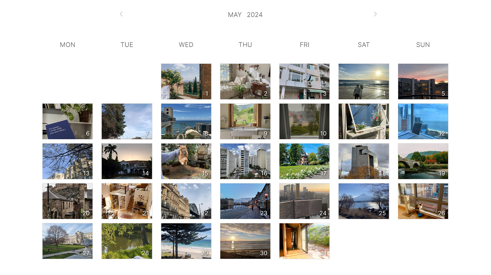
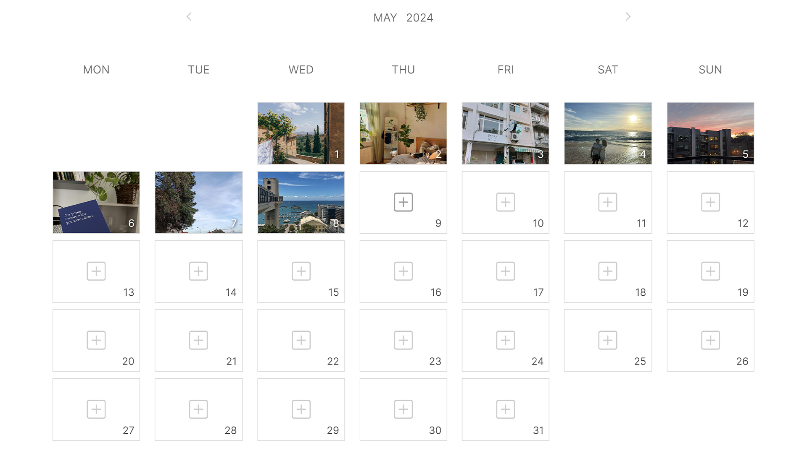
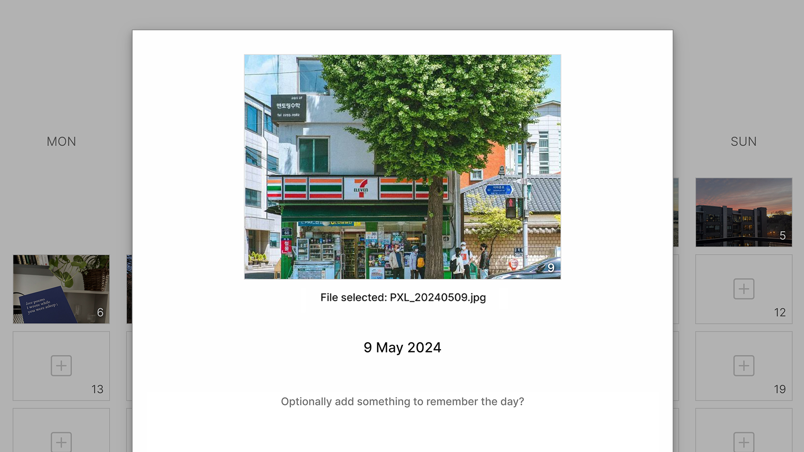
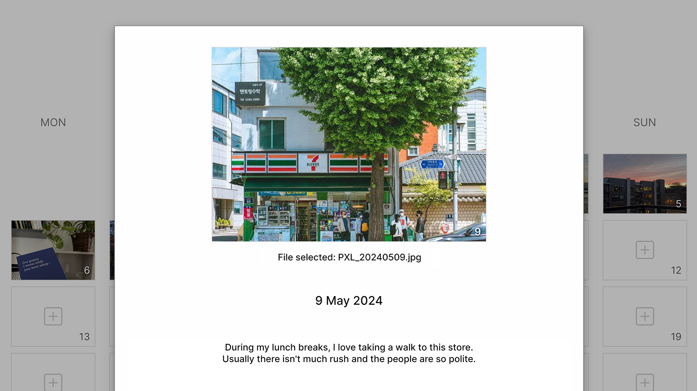
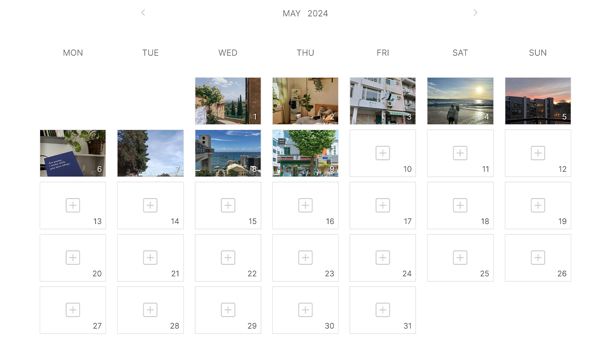
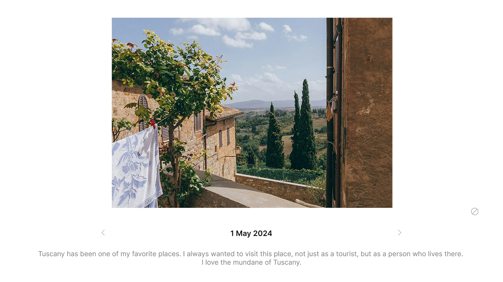
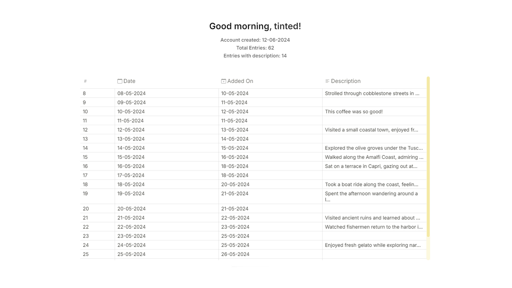
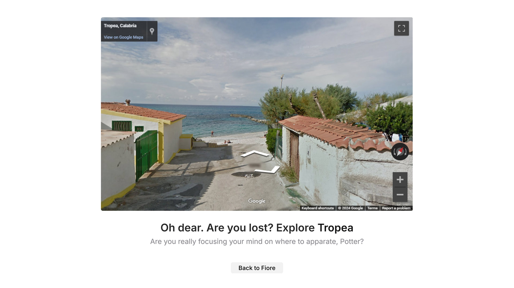

<div align="center">
	<h1>Fiore</h1>
	<p>
		<i>framing instances on rectangles everyday</i>
	</p>
</div>

Fiore combines the ideas of journaling with minimalism, giving you an experience that reflects on your life via a visual calendar.

<div align="center">
	
	
</div>


## Installation
Fiore is built on Flask, which is a Python web framework. If you don't already have Python, you can install it <a href="https://www.python.org/">here</a>.

Once Python is installed, download and open this repository and run the following command in your terminal to install all the dependencies:
``` bash
pip install -r requirements.txt
```

Run the script via this command to create the database:
``` bash
sqlite3 schema.sql
```
Note: Running the Python script will set up the database for you, so you don't need to download SQLite separately.

### Usage

Once finished with the installation, head over onceagain to your project directory and run it via
``` bash
flask run
```

## Getting started with Fiore

Fiore works by framing instances on rectangles everyday and creating a calendar that is uniquely yours. It's like flipping a page on your calendar, but on each day you see a glimpse of what your day was like. 

Fiore supports the most common image formats and has a very minimal UI, reducing the friction between you and your next journal entry. Here's how to get started!

### Pick a date
For each month, you have a blank canvas in the form of a calendar. Each day can store one image. 
<div align="center">
	
</div>

### Upload an image
Chose from a variety of image file formats (even gifs). The support for a variety of file formats ensures that no matter what your media source is, Fiore just works.
<div align="center">
	
</div>

### Maybe add a description?
Either adding a bit of context to the image, or just using it as a written journal, you have the option and space to write it.

<div align="center">
	
</div>

### Done
Fiore! Watch the memory get framed in your calendar!

<div align="center">
	
</div>


## Additional Features

Fiore is inspired by a touch of Italy. The islands, the landscapes and the beaches, they reflect the calmness that comes with intentional living and the calmness that Fiore brings to your journaling experience.

### Viewing, scrolling and deleting entries

Each day can be expanded to it's own page. It will feature the uploaded image in a much bigger size (and a description if you added that).

On the same page, you will find left and right arrow buttons. The left arrow takes you to the previous journal entry, and the right arrow takes you to the next journal entry. The entry can also be deleted from this page.

<div align="center">
	
</div>

### Profile stats

On the profile page, you can see all your account details, with list of all your entries you have created.
This page also allows you to delete your account.
<div align="center">
	
</div>

### Handling errors

Errors, be it from the user or the server, can occcur, and the apology page handles them with a Harry Potter reference while giving you a random place in Italy to explore! 
<div align="center">
	
</div>

## Acknowledgements

I have always been a [Notion](https://www.notion.so/) user and I've always admired it for its simplicity and organization. I remember the first time visiting [their website](https://www.notion.so/personal) and being so inspired by it that I dreamt of making one like it. This project was the opportunity that aligned perfectly. I also drew inspiration from cool features on other websites, like the apology page from [Wizarding World](https://www.wizardingworld.com/apology) with its playful broken link reference to a misspelled teleportation spell, and the [Google Labs](https://labs.google.com/search) page, showcasing Google's AI tools in a nice carousel. All of them came together to create the feeling of a calm Mediterranean Italian coast in a simple and organized journal app, Fiore.

For the project’s development, I used [Google Fonts](https://fonts.google.com/) to incorporate the [Inter font](https://fonts.google.com/specimen/Inter) and its variations throughout the website. [Bootstrap's icon library](https://icons.getbootstrap.com/) was really handy for the icons. The project was built using [Visual Studio Code](https://code.visualstudio.com/) as my IDE. The backend language was [Python](https://www.python.org/), and the web framework used was [Flask](https://flask.palletsprojects.com/en/3.0.x/) with [SQLite](https://flask.palletsprojects.com/en/3.0.x/patterns/sqlite3/) to manage the database.

Here are the Python libraries that helped me make this project possible:

- [flask](https://flask.palletsprojects.com/en/3.0.x/installation/#python-version)
- [flask_sessions](https://flask-session.readthedocs.io/en/latest/)
- [cs50](https://cs50.readthedocs.io/libraries/cs50/python/) (which also provided SQLite features)
- [werkzeug](https://werkzeug.palletsprojects.com/en/3.0.x/) (security and utils)
- [The Python Standard Library](#) (calendar, datetime, functools, logging, os, re, uuid)

I ran [Ubuntu](https://ubuntu.com/desktop/wsl) in [WSL](https://learn.microsoft.com/en-us/windows/wsl/) for development. Additionally, I want to thank [Stack Overflow](https://stackoverflow.com/), the visits to which got more and more frequent as the project expanded. On roadblocks, [dbb](https://cs50.ai) was really helpful. This project also introduced me to [Git](https://git-scm.com/) and [GitHub](https://github.com/), and Fiore's repository can be found [here](https://github.com/tintedwindow/fiore).


This project made me realize that there's so much to learn for me, and it also made me realize that I did learn when I finally solved each challenge, whether it was flying the net, setting up local development, making Flask work, or going from a table tag to divisions that represent days in Fiore now. :)

Once again, I was standing on the shoulder of giants. From the bottom of my heart, thank you.

